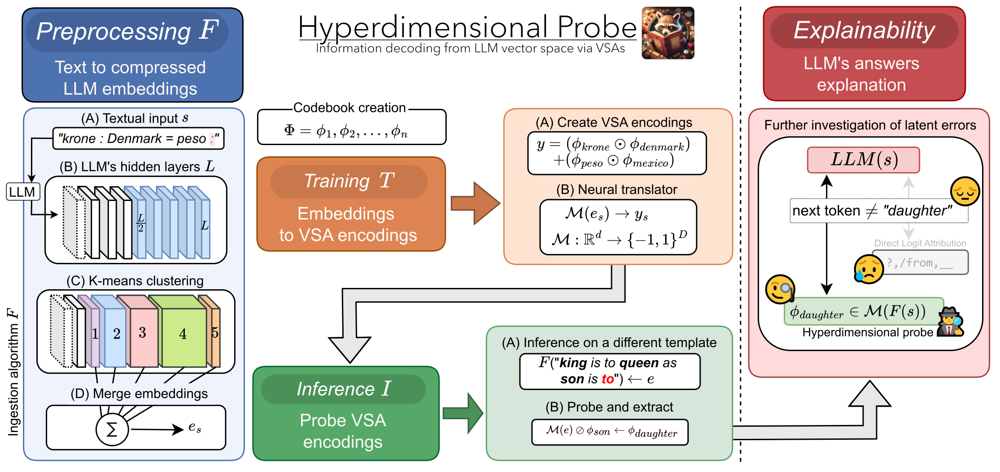
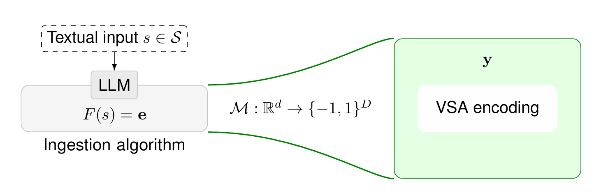
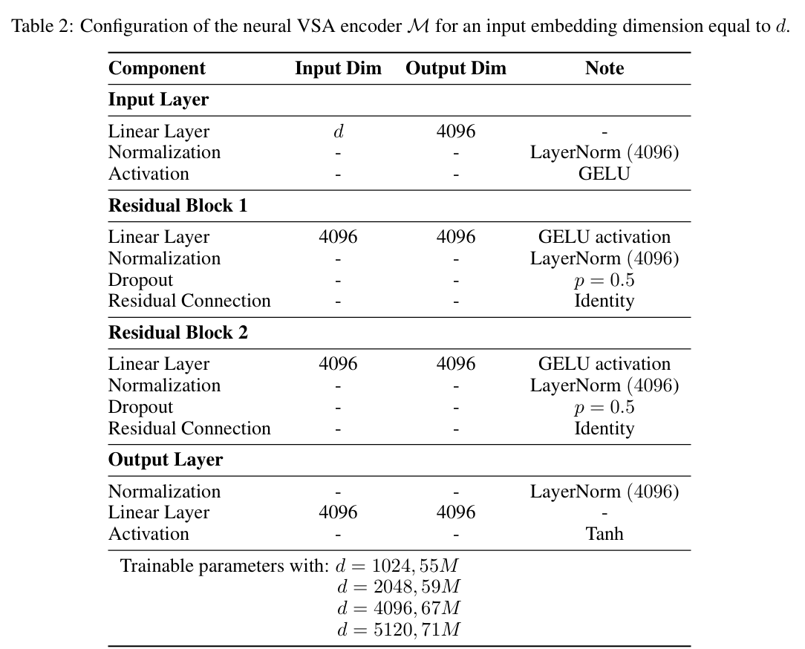
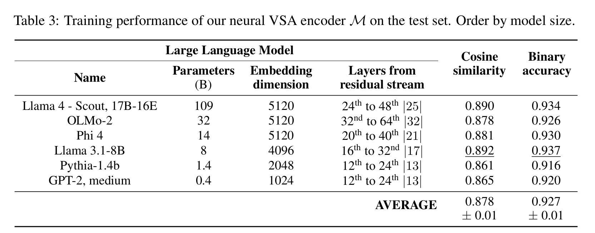
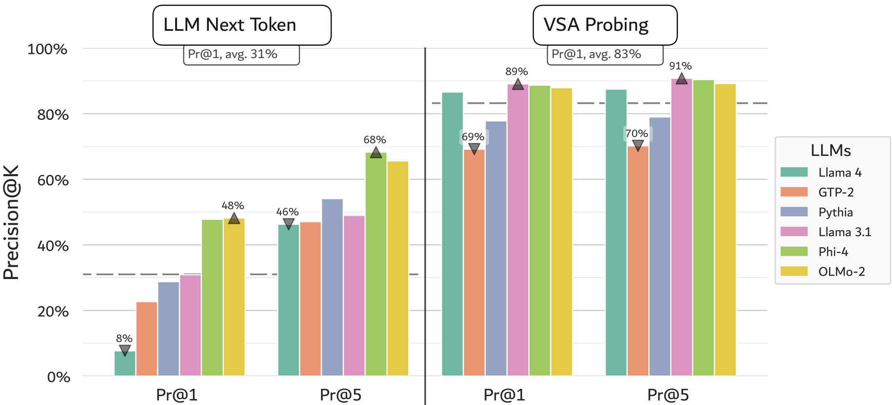
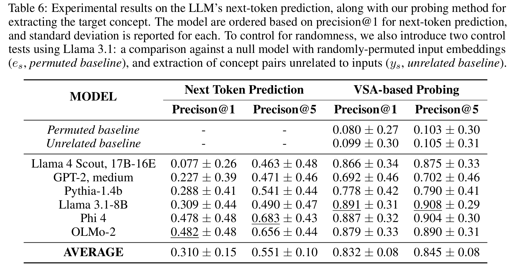
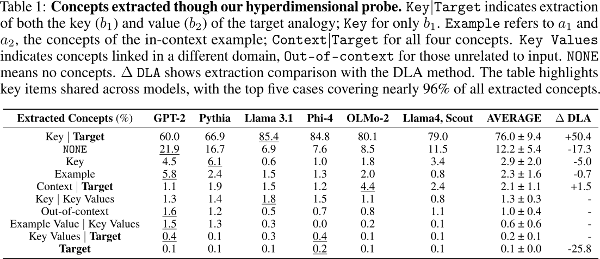

This repository is the official implementation of *"Hyperdimensional Probe: Decoding LLM Representations via Vector Symbolic Architectures"*.

## Overview
Despite their capabilities, Large Language Models (LLMs) remain opaque, with limited understanding of their internal representations.
Current interpretability methods, such as supervised probes, Direct Logit Attribution (DLA), and Sparse Autoencoders (SAEs), offer limited insight into these representations due to constraints such as model vocabulary or vague feature names. 
This work introduces *Hyperdimensional Probe*, mapping LLM residual streams into interpretable concepts using Vector Symbolic Architectures (VSAs). 
This shallow neural VSA encoder combines the strengths of conventional probes and SAEs while overcoming their key limitations. 
We validate our methodology on an analogical reasoning setting to enhance failure-case explanations. Specifically, we explore the model’s internal state for next-token prediction on a corpus of factual and linguistic analogies.
Our experiments demonstrate more effective information decoding than DLA, while mitigating variability from tokenization and prompt design, which often impact token-based probing methods.
Our work advances information decoding in LLM vector space, unlocking the potential to extract multimodal latent features.


-----

## Structure
- [``data``](data): Corpus of factual and linguistic analogies;
- [``src/hyperprobe``](src/hyperprobe) Implementation of *hyperdimensional probe*;
- [``src/script.py``](src/script.py) Script for showcasing the framework;
- [``outputs/olmo2_sample.json``](outputs/olmo2_sample.json) Findings from a sample of extracted concepts using [AllenAI's OLMo2-32B](https://huggingface.co/allenai/OLMo-2-0325-32B).

## Data
### Corpus of factual and linguistic analogies
The folder [``data``](data) includes our syntethic corpora: the [``training``](data/splitted_data.json) and [``experimental``](data/verbose_examples.json) data.
- [``features.json``](data/features.json) includes all the contextually-relevant concepts using to populate our VSA codebook.
- [``pairs.json``](data/pairs.json) stores all the key-value pairs.

**Build the corpora from scratch**: [``src/hyperprobe/data_creation/create_texts.py``](src/hyperprobe/data_creation/create_texts.py)
- [Google Analogy Test Set](https://aclweb.org/aclwiki/Google_analogy_test_set_(State_of_the_art))
- [The Bigger Analogy Test Set (BATS)](https://vecto.space/projects/BATS)

## Requirements
Download the repository, and install the python package locally via the package manager: 

```bash 
pip install -e .
```

This should automatically install dependencies from [``pyproject.toml``](pyproject.toml). If that fails, you can manually install them using ```pip install -r requirements.txt```.

## Execute via high-level APIs 
The framework can be run via standalone APIs, as detailed further in [``src/script.py``](src/script.py). 
It is designed to work with any autoregressive language models hosted on the Hugging Face platform: [huggingface.co/models](https://huggingface.co/models?pipeline_tag=text-generation&library=transformers&sort=downloads)

``` python
import hyperprobe
```

### 1) Create the VSA codebook with a user-defined set of concepts
``` python
codebook = hyperprobe.create_codebook(
    concepts = ['Denmark', 'Mexico', 'krone', 'peso'], 
    vsa_dimension = 4096)
```
### 2) Get the embeddings from an autoregressive language model
``` python
llm_embeddings, *_ = hyperprobe.ingest_embeddings(
    docs = ['Denmark : krone = Mexico : peso'], 
    model_name = 'meta-llama/Llama-4-Scout-17B-16E')
```

2a) Apply sum pooling on the LLM embeddings
``` python
llm_embeddings = {doc: embedding.sum(dim=0) for doc, embedding in llm_embeddings.items()}
```

### 3) Create the VSA encodings for the input documents
``` python
vsa_encodings = hyperprobe.create_vsa_encodings(
    item = {'doc': ' Denmark : krone = Mexico : peso', 'concepts': [('Denmark','krone'), ('Mexico', 'peso')]}, 
    codebook = codebook) 
```

### 4) Train the neural VSA encoder
```python
# Load the documents into a dataloader
dataset = hyperprobe.inputDataset(train_set)
loader = hyperprobe.llm2VSA_dataloader(dataset, batch_size = 32, val_size = 0.1, test_size = 0.1)

# Train the model
best_model_path, test_metrics = hyperprobe.train_hyperprobe(loader, configs=configs)
``` 


### 5) Probe the VSA encodings via unbinding operation
``` python
# Load the trained encoder
trained_encoder = hyperprobe.VSAEncoder.load_from_checkpoint(best_model_path)
trained_encoder.eval()

# Load the language model
llm = hyperprobe.load_llm(model_name = 'meta-llama/Llama-4-Scout-17B-16E')

# Probe the document
doc = 'Big is to small as introvert is to extravert'
extracted_concepts = hyperprobe.probe_doc(doc, codebook, llm, trained_encoder)
``` 

## Code to reproduce the results from the paper
### (A) Preprocessing *F*: From textual inputs to compressed LLM embeddings
1. Create the VSA codebook: [``src/hyperprobe/data_creation/create_codebook.py``](src/hyperprobe/data_creation/create_codebook.py)
2. Store the LLM embeddings: [``src/hyperprobe/data_creation/embeddings.py``](src/hyperprobe/data_creation/embeddings.py)

### (B) Training *T*: neural VSA encoder that maps LLM embeddings into VSA encodings
1. Train the neural VSA encoder: [``src/hyperprobe/encoder/app.py``](src/hyperprobe/encoder/app.py)

### (C) Inference *I*: Probe VSA encodings
1. Probe VSA encodings by extracting embedded concepts via unbinding: [``src/hyperprobe/probing/app.py``](src/hyperprobe/probing/app.py)

NOTE: The folder [``../probing/utils/logitLens``](src/hyperprobe/probing/utils/logitLens) contains the DLA-based experiments (LogitLens).

### (D) Evaluation: Exploratory analysis and descriptive statistics
1. Extract experimental insights by analysing the findings from the inference stage: [``src/hyperprobe/statistics/metrics.py``](src/hyperprobe/statistics/metrics.py)
2. Aggregate and compare results from different experiments (i.e., LLMs): [``src/hyperprobe/statistics/comparison.py``](src/hyperprobe/statistics/comparison.py)

## Architecture of the neural VSA encoder



## Results
### Training performance


### Experimental findings




## Computational resources
We recommend to have a GPU (see [CUDA](https://docs.nvidia.com/cuda/cuda-quick-start-guide/index.html)) to run this pipeline, especially for LLM inference (i.e., get the embeddings) and training the neural VSA encoder.

#### From Appendix H
The computational workload of this work is split into two parts: LLM inference (exogenous) and the training and probing stages of our method (endogenous).

The exogenous factor, running the Large Language Models, was the most computationally demanding task. 
For our experiments, we tested six different Large Language Models in inference mode, caching their embeddings for our training phase and probing them dynamically during the inference phase of our work.
We worked with LLMs ranging from 355M parameters (GPT-2) to 109B parameters (Llama 4, Scout), using between one and three NVIDIA A100-80GB GPUs, depending on the model size. Quantization is not employed.

In contrast, the computational demands of our VSA-based methodology were relatively low. The most resource-intensive stage was training our neural VSA encoder, but due to its modest size (ranging from $55M$ to $71M$ parameters), this process remained lightweight. 
We performed this training on a single GPU, though it could easily be handled with much less powerful and lower-memory GPUs.
The probing stage is then composed of simple vector multiplications (unbinding), after loading in memory the heavy LLM and our lightweight trained neural VSA encoder (from 800 MB of the 55M version to 1 GB of the biggest one). 
Furthermore, future research could explore VSA encodings with reduced dimensionality (e.g., $D = 512$), resulting in an even more lightweight encoder.


## Contributing
Pull requests are welcome. For major changes, please open an issue first to discuss what you would like to change.

## Citation
If you use this package or its code in your research, please cite the following work:

```bibtex
```

## License
This work is licensed under a [Creative Commons Attribution-NonCommercial-ShareAlike 4.0 International License](http://creativecommons.org/licenses/by-nc-sa/4.0).

